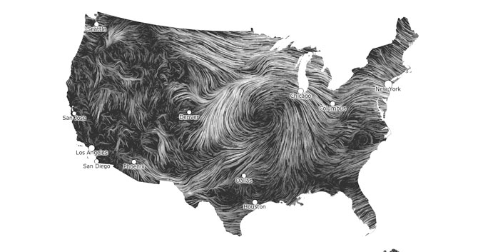
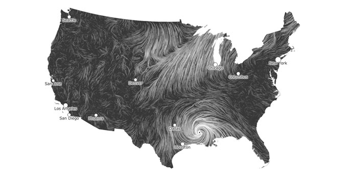
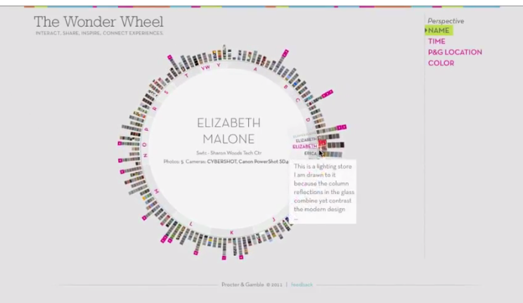

# This is my Blog Post
------

### Art Piece 1

I chose this firt piece because the idea is simple - map the wind intensity and direction on any given day. However, each day can drastically change the mood of the piece. The first one is elegant. It beautifully represents the geography of the U.S. with stronger wind speeds and longer unbroken tragecteries on the great planes, but interesting and varied trajectories in the mountain ranges and near regions that may indicate temperature changes like near the deserts or coasts. The second piece is much different. It strikes fear and empathy when you see the very strong wind speeds around Houstan during the hurricane. The much darker shared in majority of the other areas in the U.S. almost looks like the rest of the country is being still in empathy for those in the heart of the storm. Very interesting emotions sturred over something as simple as wind pattern. 

[Here's a link to the piece](
http://www.bewitched.com/windmap.html
)

### Art Piece 2

This second piece caught my eye because I really loved Periscopic: Do good with data. I have been trying to imagine ways that you could powerfully represent todays extinction crisis. The numbers are so striking, we are loosing species at 1,000 times the background rate, which is the most modest rate we can generate, and may infact be closer to 10,000 times the background rate. I will never be able to comprehend why this is not a more talked-about issue, and is why I really want to be able to visually represent some sort of data that captures the hearts of viewers. This particular piece called the Wonder Wheel, shares peoples stories, pictures and connections in a beautiful way. It would be really cool if, in some way, I could highlight critically endangeres species instead of an individual person. Some way where a person could see how many species are endangered, what they look like, and see how they are connected to the ecosystem/what would happen if we lost them. That would be an incoprehensible amount of data to sort through, but I really like the idea. 

[Here's a link to the piece](
http://www.periscopic.com/our-work/the-wonder-wheel-an-exploration-of-people-photos-stories-and-connections)

